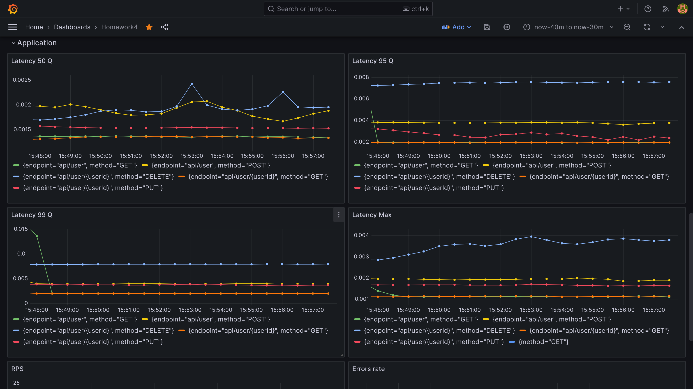
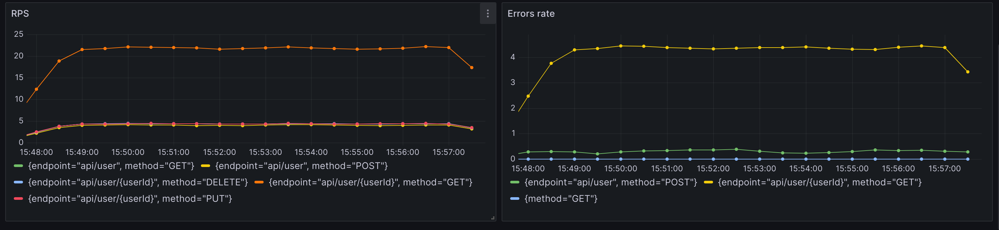
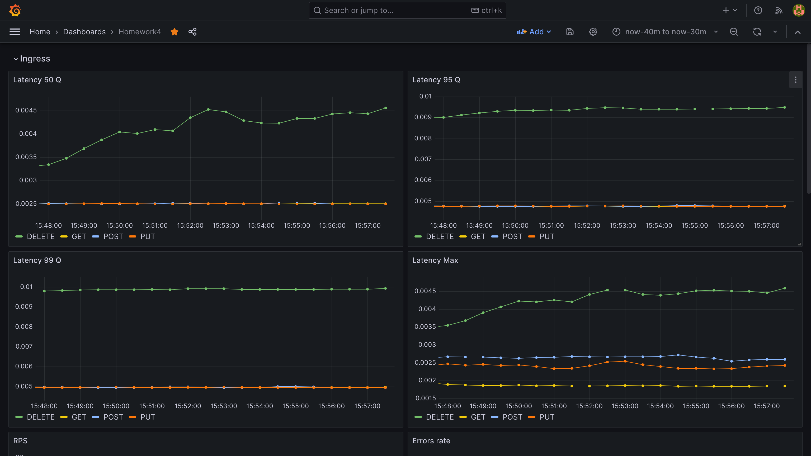
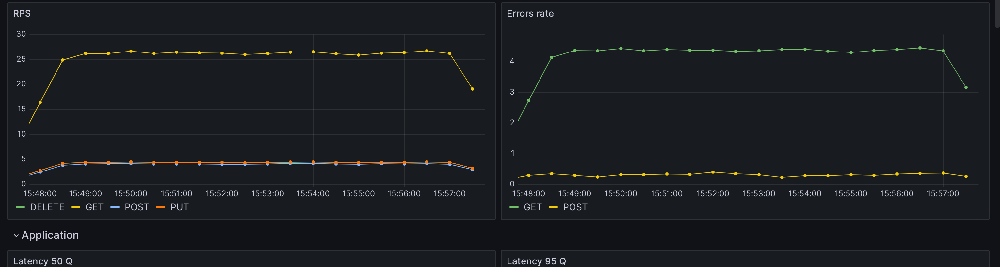
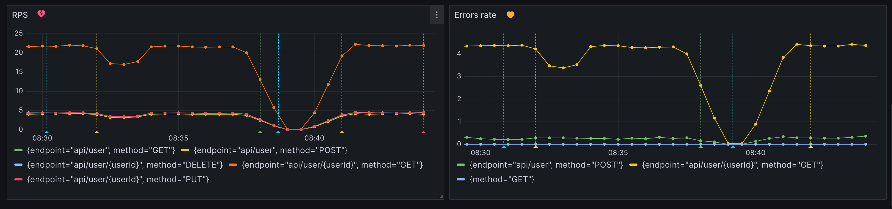
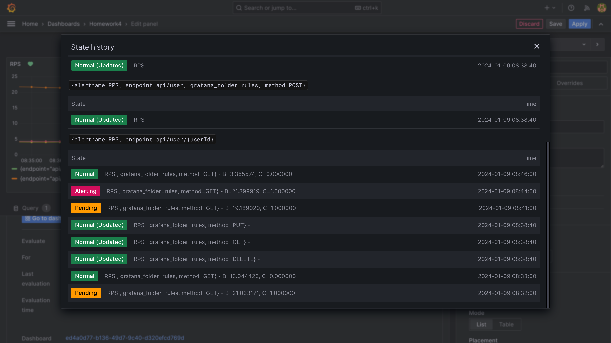

# Домашнее задание №4: Prometheus. Grafana

## Цель:
В этом ДЗ вы научитесь инструментировать сервис.

## Описание/Пошаговая инструкция выполнения домашнего задания:
Инструментировать сервис из прошлого задания метриками в формате Prometheus с помощью библиотеки для вашего фреймворка и ЯП.
Сделать дашборд в Графане, в котором были бы метрики с разбивкой по API методам:

1. Latency (response time) с квантилями по 0.5, 0.95, 0.99, max
2. RPS
3. Error Rate - количество 500ых ответов

Добавить в дашборд графики с метрикам в целом по сервису, взятые с nginx-ingress-controller:
1. Latency (response time) с квантилями по 0.5, 0.95, 0.99, max
2. RPS
3. Error Rate - количество 500ых ответов

Настроить алертинг в графане на Error Rate и Latency.

На выходе должно быть:
- скриншоты дашборды с графиками в момент стресс-тестирования сервиса. Например, после 5-10 минут нагрузки.
- json-дашборды.

Задание со звездочкой (+5 баллов)
Используя существующие системные метрики из кубернетеса, добавить на дашборд графики с метриками:
- Потребление подами приложения памяти
- Потребление подами приолжения CPU
- Инструментировать базу данных с помощью экспортера для prometheus для этой БД.
- Добавить в общий дашборд графики с метриками работы БД.
- Альтернативное задание на 1 балл (если не хочется самому ставить prometheus в minikube) https://www.katacoda.com/schetinnikov/scenarios/prometheus-client

## Результаты:

### Дашборд

Ссылка на JSON (graphana/Homework4-dashboard.json)

#### Приложение:

- Latency (response time) с квантилями по 0.5, 0.95, 0.99, max

- RPS, Error Rate 

#### Игресс:
- Latency (response time) с квантилями по 0.5, 0.95, 0.99, max

- RPS, Error Rate 

### Алерты

Настроил алерты на RPS и Error rate.

